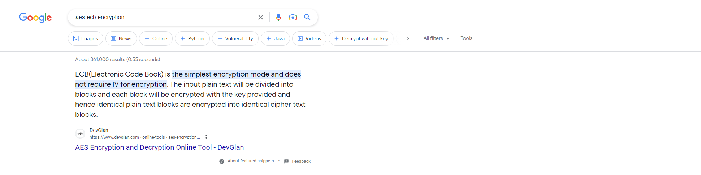
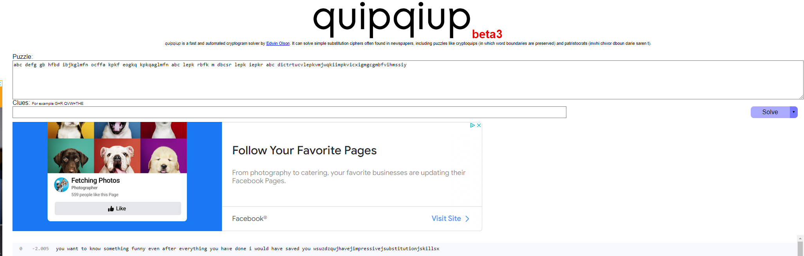

# The Lost Message

In this challenge, we have a python file that makes some hashes
and an output.txt file that contains hashes. The first thing we
can see is that the method of encryption is AES-ECB.



This method of encryption is not safe because it encrypts blocks
the same if they have the same plaintext. If we look at the file,
we see that it is encrypting each letter individually, then adding
15 bytes of padding per AES block. This means that every AES block
corresponds to 1 letter. 

(This is because each letter is 1 byte + 15 bytes of padding gives us 16 byte blocks
which is what AES encryption needs)

In order to solve this, we have to count
the frequency of these hashes and try to figure out what letter
a specific hash corresponds to.


```
def encrypt(self, message):
        return [self.cipher.encrypt(c.encode() + self.salt) for c in message]
```

Here is the code used for counting the frequencies of each of the hashes:

```

def FrequencyAnalysis():
    with open("output.txt", "r") as f:
        x = f.read()
    x = x.split("\n")
    CountFrequency(x)

def CountFrequency(my_list):
 
    # Creating an empty dictionary
    freq = {}

    #alphabet for replacing hashes with random letters
    alphabet = 	['a', 'b', 'c', 'd', 'e', 'f', 'g', 'h', 'i', 'j', 'k', 'l', 'm', 'n', 'o', 'p', 'q', 'r', 's', 't', 'u', 'v', 'w', 'x', 'y', 'z', '?', '{', '}', '.', '_', '1']

    #counter for moving through the alphabet
    counter = 0

    #for loop to count number of occurances of a hash
    for item in my_list:
        if (item in freq.keys()):
            freq[item] +=1
        else:
            freq[item] = 1
    
    #print # of occurances for hash
    for key, value in freq.items():
        print(f'{key}, {value}')
```

gives us the output:

```
a89ccfbba1b9ae627f71f335f5b421e6, 5
afa7390fe595ad05369fa911f3541bf0, 9
aee4cef880c5905402b4e443cccb3fd5, 9
c3a63e66d719a3b8f855e92802d45fca, 17
379f664528118b5d4343bb339fc48d77, 4
f6755649c813ecb73d9df04e3906b353, 6
7ab62ab181bec476bd232c42f3cfb45a, 9
6e3f54f83560879ec09617d707ee7373, 8
1ef4bc3d2795f30fb8b4ecf33ed01b6f, 2
a8e940cbb67ee3b2385d677f70e5ab7e, 9
02fef56ee2e4a390e2832c0f8374612b, 2
3893afaa875f504c8f1148a7cad0e6c0, 13
5b02ad7094b3f56cc7194ea9ec0cab1d, 5
e18ac706984ab2b662f48a93978cc519, 8
31e55b479130b2128904e9128a3bbce0, 2
379ed698ffcfb4d7f00b5fce06224db8, 2
51f70d8c0f1b50bf1e3e2a159f4ab38e, 7
6bb11fc0579fc7fc9edcf1b268448c1e, 3
ce292492f3acd8fead8c9b909d362e51, 4
72dc4b70a44b4cafa1fd4289aa96e8ed, 3
e0cf794e77a3e7bd8c7cf7d0360680fd, 2
c7a3ec107755dbbbfd2d16df089c90cb, 1
e4f76ae06a1b31d6bfad5b56910c45c4, 4
6fd4e507ae3f5c9a6fa9211f363be1fd, 1
bf18be33333ac52f91522eb5c3455da3, 1
50ca6184df3f5f332055f38fc06c51b1, 1
```

Now it is a little unclear where to go from here once we have all of of the hash frequencies,
but we know that the most common character in any phrase is the "space" followed by the letter "e",
and so on...

But for now let's just try replacing the most frequent hash with a space key, then lets try replacing each
letter with a random letter. As long as we get the spaces correct, quipqiup will solve the rest of the puzzle.

Here is the updated code for our two functions:

```
def CountFrequency(my_list):
 
    # Creating an empty dictionary
    freq = {}

    #alphabet for replacing hashes with random letters
    alphabet = 	['a', 'b', 'c', 'd', 'e', 'f', 'g', 'h', 'i', 'j', 'k', 'l', 'm', 'n', 'o', 'p', 'q', 'r', 's', 't', 'u', 'v', 'w', 'x', 'y', 'z', '?', '{', '}', '.', '_', '1']

    #counter for moving through the alphabet
    counter = 0

    <!-- #for loop to count number of occurances of a hash
    for item in my_list:
        if (item in freq.keys()):
            freq[item] +=1
        else:
            freq[item] = 1
    
    #print # of occurances for hash
    for key, value in freq.items():
        print(f'{key}, {value}') -->


    #reset dictionary
    freq = {}   

    #If hash = c3a63e66d719a3b8f855e92802d45fca, replace it with a space, otherwise assign it a random letter
    for item in my_list:
        if(item == "c3a63e66d719a3b8f855e92802d45fca"):
            freq[item] = " "
        if (item not in freq.keys()):
            freq[item] = alphabet[counter]
            counter += 1
    

    list_of_strings = [str(freq[x]) for x in my_list]

    return list_of_strings


    def FrequencyAnalysis():
        with open("output.txt", "r") as f:
            x = f.read()
        x = x.split("\n")
        strings = CountFrequency(x)
        print("".join(strings))
```

After replacing each letter with a random letter, and replacing the most common hash with a space,
we can run the file and get this output:

> abc defg gb hfbd ibjkglmfn ocffa kpkf eogkq kpkqaglmfn abc lepk rbfk m dbcsr lepk iepkr abc dictrtucvlepkvmjwqkiimpkvicxigmgcgmbfvihmssiy

## Decrypting with quipqiup:

After putting this output into quipqiup, we get:



(I apologize for the flag format in the description of the challenge being confusing. I originally changed both the flag format for the answer to this challenge and the flag you see in the text to WSUCDC{flag} but another admin must've changed it back before the challenge started to {WSUCDC:flag} to make it consistent. Sorry again if you got this wrong because of the flag format not working.)

We need to use one more hint from the problem to solve this challenge. This piece of code helps us figure out what some of the different letters represent because the output still doesn't quite make sense.

```
assert all([x.isupper() or x in '{_} ' for x in secretMessage])
```

This line of code tells us that all letters in the message must be uppercase or must be either a "{", "_", "}", or " " symbol.

Now we are almost done. The description of the challenge told us that the flag format was WSUCDC{} so we know that the "z" in this challenge must actually be a "c", and the "q" must be a "{" and the x must be a "}"
and going back to the line of code above, the only other symbol we have left is an underscore, so the j must be an underscore for this to make sense.

Now we get the flag:

> {WSUCDC:U_HAVE_IMPRESSIVE_SUBSTITUTION_SKILLS}
